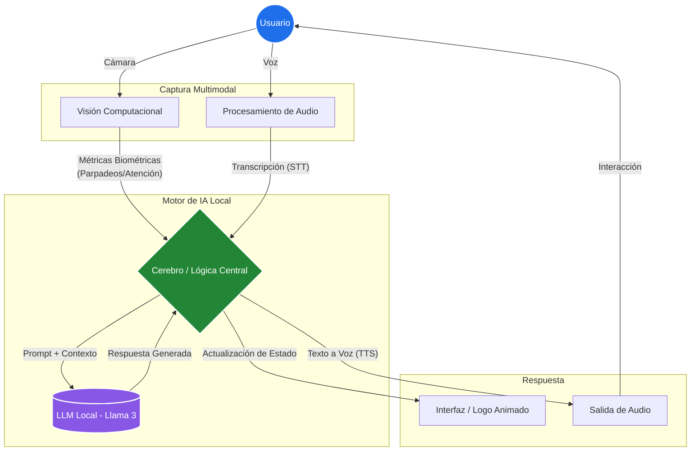

# 🧠 Nira: AI Personal Instructor & Biometric Interviewer

## 📌 Visión General
**Nira** es una aplicación impulsada por Inteligencia Artificial diseñada para simular entrevistas de estrés de alta exigencia. A diferencia de un chatbot tradicional, Nira analiza en tiempo real las respuestas y biometría del usuario para generar interacciones dinámicas, evaluando tanto la capacidad técnica como el manejo de la presión.

Este proyecto fue construido con un fuerte enfoque en la **Privacidad de los Datos**, ejecutando los modelos de lenguaje (Llama 3) de manera completamente local para asegurar que la información biométrica y personal del usuario nunca salga de su entorno.

## ✨ Características Principales
* **Análisis Biométrico y Microexpresiones:** Procesamiento de datos en tiempo real para adaptar la actitud del entrevistador según el nivel de estrés detectado.
* **Procesamiento de Audio Bidireccional:** Generación de respuestas dinámicas por voz.
* **Privacidad por Diseño (Privacy by Design):** Arquitectura local (Ollama/Open WebUI) que cumple con los estándares de Gobierno de Datos al no enviar PII (Personal Identifiable Information) a la nube.
* **Interfaz Dinámica:** UI reactiva con animaciones SVG integradas.

##  Arquitectura del Sistema

**Flujo de Datos:**
1. Captura de inputs (Voz y Biometría de video).
2. Procesamiento local y extracción de métricas.
3. Ingesta de contexto hacia el modelo Llama 3.
4. Generación de respuesta (Texto a Voz) y actualización de interfaz (SVG).

##  Stack Tecnológico
* **Lenguaje Core:** Python 3.x
* **Frontend (Desktop UI):** PyQt6 (Multithreading asíncrono) | PyQt6.QtSvg | Pygame
* **Visión Computacional:** OpenCV (`cv2`) | MediaPipe (Face Mesh & Pose) | NumPy
* **Motor de IA Local:** Ollama (Llama 3 local inference)
* **Procesamiento de Audio:** SpeechRecognition (STT) | Edge TTS (Voces neuronales)
* **Ingesta de Datos:** PyMuPDF (`fitz`) | python-docx (Extracción de contexto desde CVs)

---
*Desarrollado por Luis - Integrando Arquitectura Cloud, IA y Ciberseguridad.*
